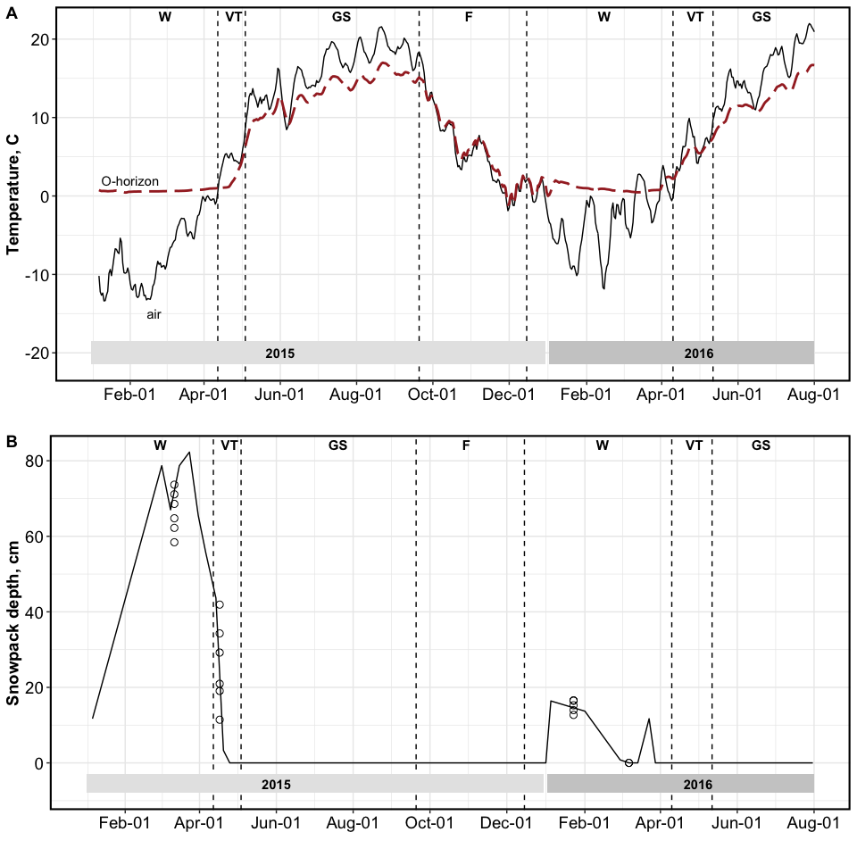
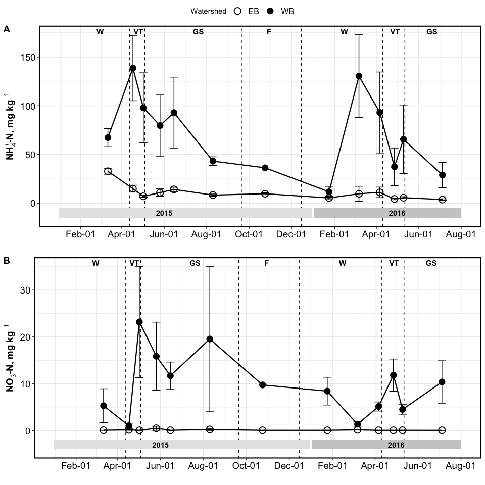
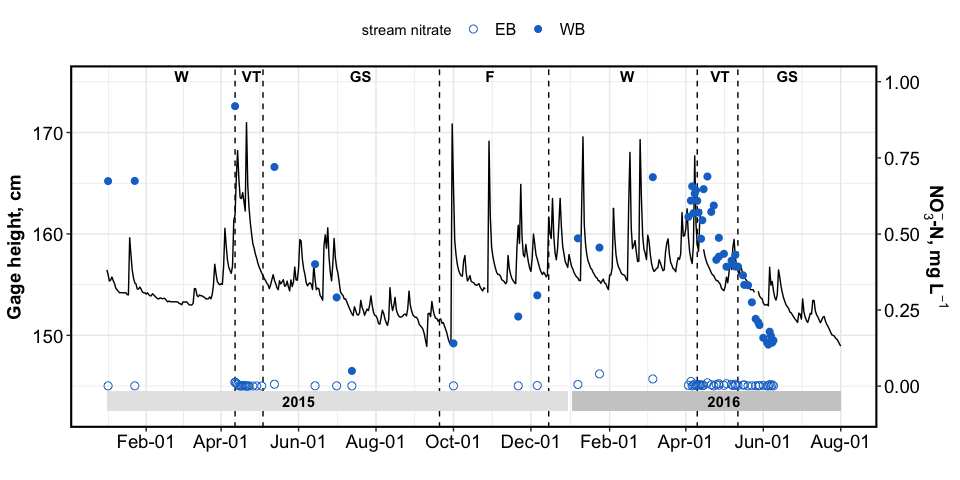

Vernal Transition Markdown Report
================

# TEMPERATURE AND SNOWPACK

<!-- -->

# SOILS

<!-- -->

# STREAMS

<!-- -->

-----

Date run: 2020-11-15

    #> R version 4.0.2 (2020-06-22)
    #> Platform: x86_64-apple-darwin17.0 (64-bit)
    #> Running under: macOS Catalina 10.15.7
    #> 
    #> Matrix products: default
    #> BLAS:   /Library/Frameworks/R.framework/Versions/4.0/Resources/lib/libRblas.dylib
    #> LAPACK: /Library/Frameworks/R.framework/Versions/4.0/Resources/lib/libRlapack.dylib
    #> 
    #> locale:
    #> [1] en_US.UTF-8/en_US.UTF-8/en_US.UTF-8/C/en_US.UTF-8/en_US.UTF-8
    #> 
    #> attached base packages:
    #> [1] stats     graphics  grDevices utils     datasets  methods   base     
    #> 
    #> other attached packages:
    #>  [1] ggpubr_0.4.0      agricolae_1.3-3   car_3.0-9         carData_3.0-4    
    #>  [5] nlme_3.1-148      stringi_1.4.6     ggExtra_0.9       ggalt_0.4.0      
    #>  [9] reshape2_1.4.4    knitr_1.29        qwraps2_0.4.2     cowplot_1.0.0    
    #> [13] data.table_1.13.0 Rmisc_1.5         plyr_1.8.6        lattice_0.20-41  
    #> [17] forcats_0.5.0     stringr_1.4.0     dplyr_1.0.1       purrr_0.3.4      
    #> [21] readr_1.3.1       tidyr_1.1.1       tibble_3.0.3      ggplot2_3.3.2    
    #> [25] tidyverse_1.3.0   lubridate_1.7.9   readxl_1.3.1     
    #> 
    #> loaded via a namespace (and not attached):
    #>  [1] fs_1.5.0           ash_1.0-15         RColorBrewer_1.1-2 httr_1.4.2        
    #>  [5] tools_4.0.2        backports_1.1.8    R6_2.4.1           AlgDesign_1.2.0   
    #>  [9] KernSmooth_2.23-17 questionr_0.7.1    DBI_1.1.0          colorspace_1.4-1  
    #> [13] withr_2.2.0        gridExtra_2.3      tidyselect_1.1.0   klaR_0.6-15       
    #> [17] curl_4.3           compiler_4.0.2     extrafontdb_1.0    cli_2.0.2         
    #> [21] rvest_0.3.6        xml2_1.3.2         labeling_0.3       scales_1.1.1      
    #> [25] proj4_1.0-10       digest_0.6.25      foreign_0.8-80     rmarkdown_2.3     
    #> [29] rio_0.5.16         pkgconfig_2.0.3    htmltools_0.5.0    extrafont_0.17    
    #> [33] labelled_2.5.0     highr_0.8          dbplyr_1.4.4       fastmap_1.0.1     
    #> [37] maps_3.3.0         rlang_0.4.7        rstudioapi_0.11    shiny_1.5.0       
    #> [41] farver_2.0.3       generics_0.0.2     combinat_0.0-8     jsonlite_1.7.0    
    #> [45] zip_2.1.0          magrittr_1.5       Rcpp_1.0.5         munsell_0.5.0     
    #> [49] fansi_0.4.1        abind_1.4-5        lifecycle_0.2.0    yaml_2.2.1        
    #> [53] MASS_7.3-51.6      grid_4.0.2         blob_1.2.1         promises_1.1.1    
    #> [57] crayon_1.3.4       miniUI_0.1.1.1     haven_2.3.1        hms_0.5.3         
    #> [61] pillar_1.4.6       ggsignif_0.6.0     reprex_0.3.0       glue_1.4.1        
    #> [65] evaluate_0.14      modelr_0.1.8       vctrs_0.3.2        httpuv_1.5.4      
    #> [69] Rttf2pt1_1.3.8     cellranger_1.1.0   gtable_0.3.0       assertthat_0.2.1  
    #> [73] openxlsx_4.1.5     xfun_0.16          mime_0.9           xtable_1.8-4      
    #> [77] broom_0.7.0        rstatix_0.6.0      later_1.1.0.1      cluster_2.1.0     
    #> [81] ellipsis_0.3.1
